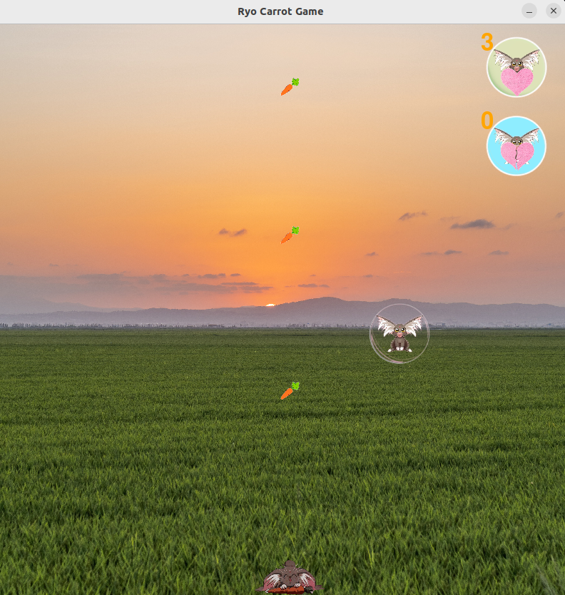

# Ryo Carrot Game

My first game using Pygame!

Play the game [here](https://susanagit.itch.io/ryo-carrot-game).

## Features

- **Controls**: Use the arrow keys to move. Tap the space or c keys to throw carrots (on mobile, swipe up to throw).
- **Music**: Background music by [BenSound](https://www.bensound.com), License code: SES9TCRFZ5LYRORV.

## How to Play

1. **Desktop**: Use arrow keys to move and space or "c" to throw carrots.
2. **Mobile**: Swipe up to throw carrots and drag left/right to move.